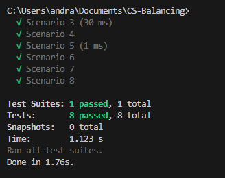

# 💻 Descrição

Este desafio consiste em um sistema de balanceamento entre clientes e Customer Success (CSs). Os CSs são os Gerentes de Sucesso, são responsáveis pelo acompanhamento estratégico dos clientes.

Dependendo do tamanho do cliente - aqui nos referimos ao tamanho da empresa - nós temos que colocar CSs mais experientes para atendê-los.

Um CS pode atender mais de um cliente, além disso os CSs também podem sair de férias, tirar folga, ou mesmo ficarem doentes, então é preciso levar esses critérios em conta na hora de rodar a distribuição.

Dado este cenário, o sistema distribui os clientes com os CSs de capacidade de atendimento mais próxima (maior) ao tamanho do cliente.

## Exemplo

Se temos 6 clientes com os seguintes níveis: 20, 30, 35, 40, 60, 80 e dois CSs de níveis 50 e 100, o sistema deveria distribui-los da seguinte forma:

20, 30, 35, 40 para o CS de nível 50
60 e 80 para o CS de nível 100
Sendo n o número de CSs, m o número de clientes e t o número de abstenções de CSs, calcular quais clientes serão atendidos por quais CSs de acordo com as regras apresentadas.

## Premissas

Todos os CSs têm níveis diferentes
Não há limite de clientes por CS
Clientes podem ficar sem serem atendidos
Clientes podem ter o mesmo tamanho
0 < n < 1.000
0 < m < 1.000.000
0 < id do cs < 1.000
0 < id do cliente < 1.000.000
0 < nível do cs < 10.000
0 < tamanho do cliente < 100.000
Valor máximo de t = n/2 arredondado para baixo

## 🛠️ Instalação

1. No terminal em sua máquina localmente, execute o comando:

```bash
   # Clone Repository
   $ git clone https://github.com/BrunaABraguin/CS-Balancing.git
```

2. Para instalação do projeto, execute o comando:

```bash
yarn
```

## Testando

Execute o comando a seguir:

```bash
yarn test
```
